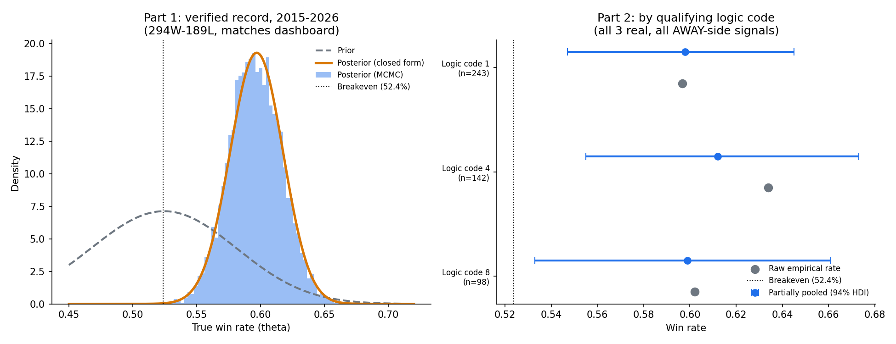

# Sports Pricing Models

End-to-end against-the-spread (ATS) pricing for college football (CFB) and the NFL: live data ingestion on Databricks, feature engineering, model scoring, and statistical validation of the results.

**Data → Features → Model → Validation**

| Stage | What it does | Where |
|---|---|---|
| Ingestion | Pulls games, scores and sportsbook lines from APIs into Delta tables, with daily incremental refreshes | [`ingestion/`](ingestion) |
| Features | Rolling form, strength of schedule and head-to-head features, built to avoid leakage | [`features/`](features) |
| Models | Python rebuild of the CFB and NFL pricing models (in progress) | [`models/`](models) |
| Validation | Bayesian / MCMC validation of the NFL pick record | [`validation/`](validation) |

## Results at a glance

| Model | Sample | Record | ATS win rate |
|---|---|---|---|
| NFL ATS | 2015-2026, 483 decided picks | 294 W / 189 L | 60.9% |
| CFB spread | 2021-2025, 1,327 picks from 13,624 games | - | 57.7% (+7.7% EV/game) |

Breakeven at standard -110 pricing is 52.4%. Both results are backtested; see [Validation](#validation) for how the NFL record holds up and its limits.

## Repository structure

```
sports-pricing-models/
├── ingestion/
│   ├── cfb/
│   │   ├── Import_CFB_Historical_Data_2007-2022.py   # Historical game import (2007-2022)
│   │   ├── CFB_Historical_Backfill_2014-2020.py      # One-time backfill (2014-2020)
│   │   ├── CFB_Data_Ingestion_Daily_Refresh.py       # Daily incremental MERGE refresh
│   │   └── CFB_Odds_API_Spread_Ingestion.py          # Live spreads from The Odds API
│   └── nfl/
│       ├── NFL_Daily_Source_Refresh.py               # Daily nflverse sync
│       ├── NFL_Live_Odds_Update.py                   # Live spreads (3x daily)
│       └── NFL_Backfill_Opening_Spreads_TeamRankings.py  # Opening spread backfill
├── features/
│   ├── cfb_feature_engineering.sql                   # CFB model features
│   └── nfl_combined_analysis_7day_refresh.sql        # NFL 7-day reporting refresh
├── models/                                           # Python model rebuild (in progress)
├── validation/
│   ├── nfl_bayesian_validation.py                    # Beta-Binomial + hierarchical MCMC
│   ├── win_rate_posterior_simple.py                  # Posterior chart
│   ├── win_rate_certainty_curve.py                   # "At least this good" curve
│   └── figures/
└── requirements.txt
```

## Ingestion

### CFB

**Source:** College Football Data API (collegefootballdata.com)

1. Fetch game scores and betting lines from the CFBD API, with retry and null-safe type casting
2. Select the consensus spread across sportsbooks with `scipy.stats.mode`
3. Merge scores and lines on game ID in PySpark
4. Incremental `MERGE` (update/insert) so history is preserved as new lines arrive

**Tables:** `cfb_merged_data` (game-level fact table, ~11,000 rows, 39 columns) and `cfb_ml_features` (model features).

### NFL

**Sources:** nflverse (GitHub), The Odds API, TeamRankings.com

1. Fetch the latest `games.csv` from nflverse
2. Pull live spreads from The Odds API and take the consensus (mode, falling back to median) across US books
3. Update derived columns (point differential, spread result)
4. `MERGE` into the enhanced source-of-truth table, then refresh a 7-day reporting window

**Tables:** `nfl_complete_analysis` (base games, 2015-2026), `nfl_betting_analysis`, `nfl_combined_analysis_enhanced` (source of truth) and `nfl_combined_analysis` (7-day reporting).

## Features

- Rolling windows (last 3 / last 5 games) for points, margin and win percentage
- **Leakage control:** rolling stats exclude the current game
- Strength of schedule (cumulative opponent win %)
- Head-to-head history (3-season lookback)
- Data quality flags for unplayed games
- Era split around the 2021 NIL rule change (CFB)

## Models

Production scoring currently runs in Power BI/DAX. [`models/`](models) holds the Python rebuild:

- **CFB:** OLS and logistic regression with pre/post-2021 era splits. Backtested on 13,624 games (2021-2025): 1,327 selected picks, 57.7% ATS.
- **NFL:** away-side model that qualifies picks through three distinct rules ("logic codes") rather than one blanket threshold.

## Validation

### Bayesian / MCMC check of the NFL record

A Beta-Binomial posterior over the 294-189 record, solved in closed form and with MCMC (PyMC, NUTS), to confirm the two agree before using MCMC on the harder hierarchical problem.

- Posterior mean: 59.7%, 95% credible interval 55.6% to 63.7%
- MCMC matches the closed form (r-hat 1.0)
- Posterior probability the true win rate beats 52.4% breakeven: 99.98%

A hierarchical (partially pooled) model across the three logic codes uses a non-centered parameterization to avoid funnel geometry. The first run produced 5 divergent transitions; raising `target_accept` to 0.995 and extending tuning produced a clean run (r-hat 1.0 on all parameters).

| Logic code | Record | Win rate |
|---|---|---|
| 1 | 145 / 243 | 59.7% |
| 4 | 90 / 142 | 63.4% |
| 8 | 59 / 98 | 60.2% |



### What validation caught

- **Leakage in a legacy field.** An older set of fields showed a near-100% win rate for ten straight seasons, then collapsed to a coin flip in the newest season. That pattern is a signature of look-ahead bias, not edge. Tracing it to the authoritative `Pick Result` field, verified three ways against raw scores and spreads, gave the stable ~60% result above.
- **A miscalibrated Edge field (CFB).** It looked good in aggregate but didn't track true win probability, so it was pulled rather than shipped.

### Limitations and next steps

- **In-sample selection.** The NFL logic codes were defined on the same seasons they are scored on, so the posterior describes in-sample performance. Walk-forward validation (rules fit before season X, scored after) is next.
- **Calibration and CLV.** Next evaluation adds Brier score, a reliability curve and closing line value against closing lines.
- The `Sum of PM Edge %` field equals each logic code's realized win rate, which suggests it is a descriptive backtest statistic rather than a forward prediction. It is not used as a probability.

## Setup

API keys are not stored in this repo. Supply your own:

- College Football Data API: https://collegefootballdata.com
- The Odds API: https://the-odds-api.com

The ingestion notebooks are Databricks exports and run on Databricks (serverless jobs). The validation scripts run locally:

```
pip install -r requirements.txt
python validation/nfl_bayesian_validation.py
```

## Tech stack

Python (pandas, NumPy, SciPy, requests), PySpark, Databricks Delta Lake and SQL, PyMC / ArviZ, Power BI / DAX for current production scoring.
